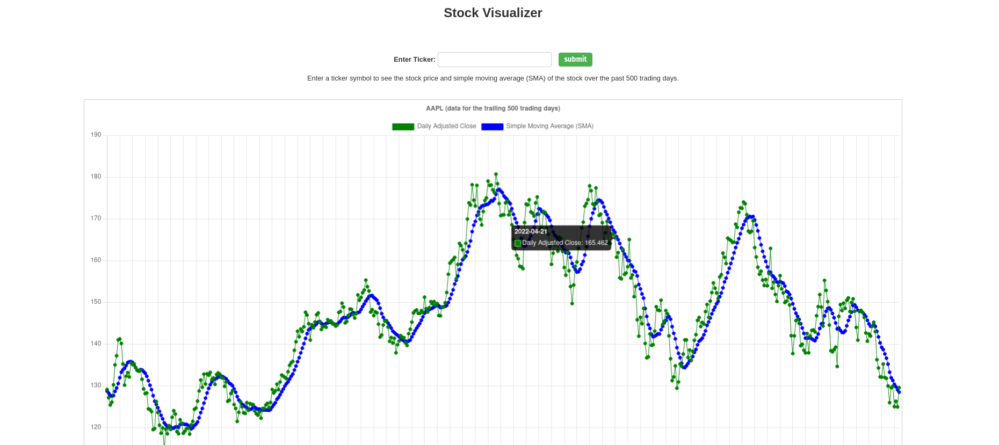

## [Getting stocks from Alpha Vantage API and visualizing on a full stack django project - repo link](https://github.com/sergio-abu/Django-Stocks-Visualizer) 



Clone the repo:
```
git clone https://github.com/sergio-abu/Django-Stocks-Visualizer.git
```
Run pipenv:
```
pipenv install
pipenv shell
```
#### Add your api key in view/views.py.


Then run local server (inside environment):
```
python manage.py runserver
```
